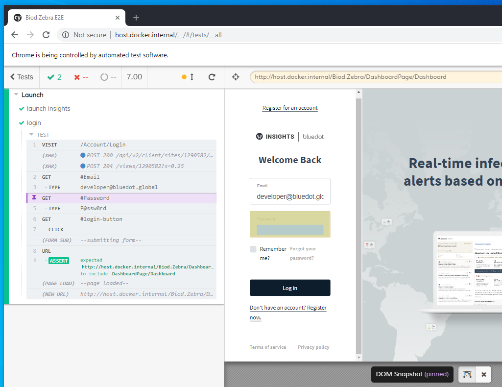
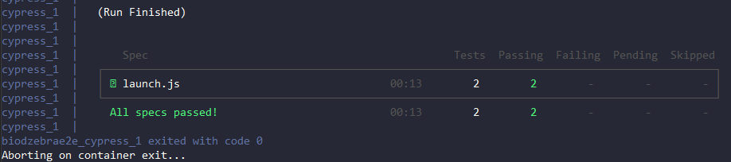

# Introduction 
End to End tests for Zebra

## Getting Started
E2E testing is done using [Cypress](https://docs.cypress.io/guides/overview/why-cypress.html#In-a-nutshell). 

## Software Requirements
E2E tests can be run in two ways:
+ Locally using NodeJs. [System requirements](https://docs.cypress.io/guides/getting-started/installing-cypress.html#System-requirements).
+ CI build using docker image. Requires [Docker for Desktop](https://hub.docker.com/editions/community/docker-ce-desktop-windows) installed on TFS build agent.

## Running E2E tests locally
1. Launch nodejs command propmt and change directory to root folder
2. Run command `npm run test:ui` to launch Cypress UI 
3. Click on `Run all specs` button
> 

### Debug E2E tests
Check [debugging guide](https://docs.cypress.io/guides/guides/debugging.html#Using-debugger) on cypress website

## Running E2E tests on CI build
1. From build add step to launch command propmt and change directory to root folder
2. Run command: `npm run test:headless` 

### Debug E2E tests
Every test run records videos that are stored in folder `videos` and takes screenshots on error that are stored in folder `screenshots`. Reviewing screenshots and vides will give you clues on errors.

## Writing E2E tests
+ Test are written in javascript file and stored in `cypress/integration` folder
+ [Best practices](https://docs.cypress.io/guides/references/best-practices.html)
